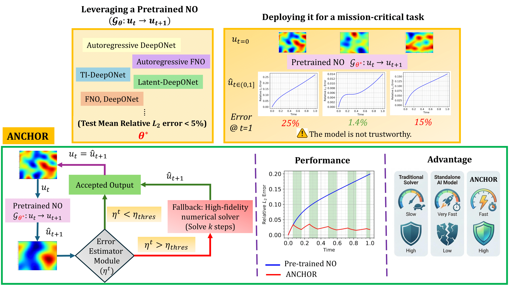

# ANCHOR: Adaptive Numerical Correction for High-Fidelity Operator Rollouts

[Rajyasri Roy](https://scholar.google.com/citations?user=xMDfoLkAAAAJ&hl=en&oi=ao), [Dibyajyoti Nayak](https://scholar.google.com/citations?user=iAdGHHQAAAAJ&hl=en&oi=ao), and [Somdatta Goswami](https://scholar.google.com/citations?hl=en&user=GaKrpSkAAAAJ&view_op=list_works&sortby=pubdate)

In this work, we propose ANCHOR (Adaptive Numerical Correction for High-fidelity Operator Rollouts), an online, instance-aware, error-controlled hybrid inference framework that enables stable and accurate long-horizon prediction for nonlinear, time-dependent PDEs. ANCHOR treats a pretrained NO as the primary inference engine and adaptively couples it with a classical numerical solver through a physics-informed, residual-based error estimator. Inspired by adaptive time-stepping in numerical analysis, ANCHOR continuously monitors an exponential moving average (EMA) of the normalized PDE residual to detect accumulating error and trigger corrective solver interventions without requiring access to ground-truth solutions.

## Proposed Architecture

## Results
<table>
  <thead>
    <tr>
      <th>PDE Example</th>
      <th>Sample #</th>
      <th>NS only (s)</th>
      <th>TI-DON only (s)</th>
      <th>ANCHOR (Ours) (s)</th>
    </tr>
  </thead>
  <tbody>
    <tr>
      <td rowspan="2"><b>1D Burgers'</b></td>
      <td>#1</td>
      <td>0.15</td>
      <td>0.049</td>
      <td>0.22</td>
    </tr>
    <tr>
      <td>#2</td>
      <td>0.156</td>
      <td>0.0714</td>
      <td>0.163</td>
    </tr>
    <tr>
      <td rowspan="2"><b>2D Burgers'</b></td>
      <td>#1</td>
      <td>7.86</td>
      <td>0.139</td>
      <td>4.842</td>
    </tr>
    <tr>
      <td>#2</td>
      <td>7.915</td>
      <td>0.136</td>
      <td>4.089</td>
    </tr>
    <tr>
      <td rowspan="2"><b>2D Allen-Cahn</b></td>
      <td>#1</td>
      <td>3.22</td>
      <td>0.075</td>
      <td>1.04</td>
    </tr>
    <tr>
      <td>#2</td>
      <td>3.13</td>
      <td>0.076</td>
      <td>0.99</td>
    </tr>
    <tr>
      <td rowspan="2"><b>3D Heat</b></td>
      <td>#1</td>
      <td>2.735</td>
      <td>0.178</td>
      <td>1.084</td>
    </tr>
    <tr>
      <td>#2</td>
      <td>2.677</td>
      <td>0.176</td>
      <td>1.017</td>
    </tr>
  </tbody>
</table>

## Datasets

Link to the datasets used in this work: [ANCHOR_datasets](https://livejohnshopkins-my.sharepoint.com/personal/sgoswam4_jh_edu/_layouts/15/onedrive.aspx?id=%2Fpersonal%2Fsgoswam4%5Fjh%5Fedu%2FDocuments%2FCentrum%20IntelliPhysics%2FTI%2DDeepoNet&ga=1)

